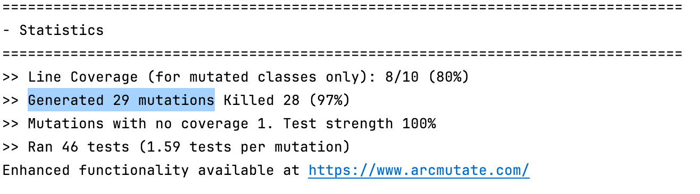
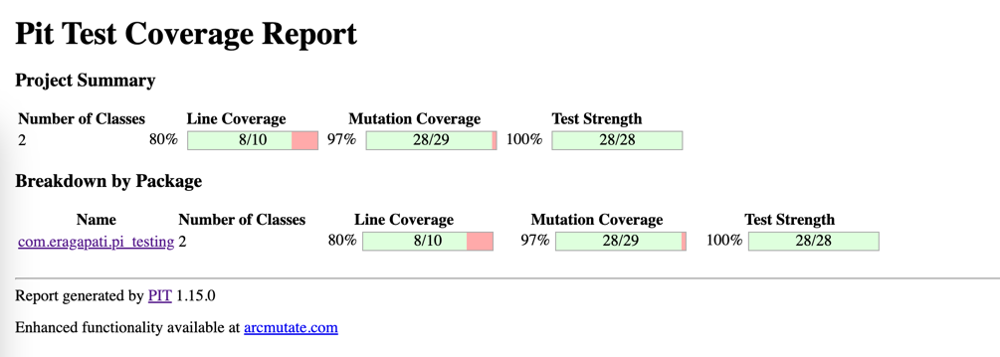
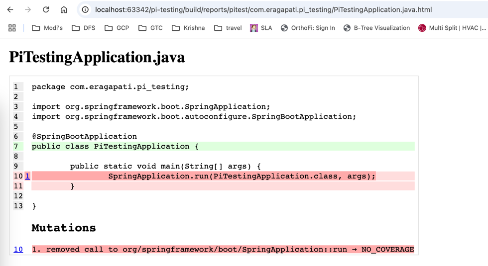

# pi-testing
 PIT originally stood for Parallel Isolated Test. Now it stands for PIT.

Faults/mutations are introduced into your code at runtime, then your tests are run. 

If(UnitTests fail) 
then mutationStatus = killed; // This means our UnitTest are good at catching mutation in behaviour.

else 
then mutationStatus = lived; // This means our UnitTest are not good enough to fail when the behaviour of our methods/function change.

The quality of your tests can be gauged from the percentage of mutations killed. 


# You can manually set the mutationThreshold as shown below 
```gradle
    pitest {
        //adds dependency to org.pitest:pitest-junit5-plugin and sets "testPlugin" to "junit5"
        junit5PluginVersion = '1.2.1'
        mutationThreshold = 80
        }
```


# Active mutators

## Available mutators:
https://pitest.org/quickstart/mutators/

# Config PIT to run with all mutators
```gradle
    pitest {
        mutators = ["ALL"] // if you want to exclude a group then put a minus symbol in-front of GROUP code
    }
```


## Default mutators:
* CONDITIONALS_BOUNDARY 
* EMPTY_RETURNS 
* FALSE_RETURNS 
* INCREMENTS 
* INVERT_NEGS 
* MATH 
* NEGATE_CONDITIONALS 
* NULL_RETURNS 
* PRIMITIVE_RETURNS 
* TRUE_RETURNS 
* VOID_METHOD_CALLS

## All mutators:
* Active mutators
* CONDITIONALS_BOUNDARY
* CONSTRUCTOR_CALLS
* EMPTY_RETURNS
* EXPERIMENTAL_ARGUMENT_PROPAGATION
* EXPERIMENTAL_BIG_DECIMAL
* EXPERIMENTAL_BIG_INTEGER
* EXPERIMENTAL_MEMBER_VARIABLE
* EXPERIMENTAL_NAKED_RECEIVER
* EXPERIMENTAL_REMOVE_SWITCH_MUTATOR_[0-99]
* EXPERIMENTAL_SWITCH
* FALSE_RETURNS
* INCREMENTS
* INLINE_CONSTS
* INVERT_NEGS
* MATH
* NEGATE_CONDITIONALS
* NON_VOID_METHOD_CALLS
* NULL_RETURNS
* PRIMITIVE_RETURNS
* REMOVE_CONDITIONALS_EQUAL_ELSE
* REMOVE_CONDITIONALS_EQUAL_IF
* REMOVE_CONDITIONALS_ORDER_ELSE
* REMOVE_CONDITIONALS_ORDER_IF
* REMOVE_INCREMENTS
* TRUE_RETURNS
* VOID_METHOD_CALLS

# Report





